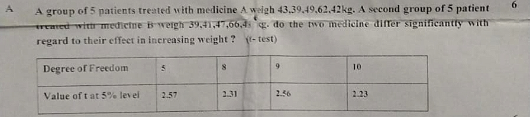

# Probability-Statistics
---
### Q 2 A.

#### Given Data
- **Group 1 (Medicine A)**: 43, 39, 49, 62, 42 kg
- **Group 2 (Medicine B)**: 39, 41, 47, 66, 48 kg

#### Step-by-Step Process

##### 1. Calculate Means
$\[
\bar{X}_1 = \frac{43 + 39 + 49 + 62 + 42}{5} = 47
\]$
 
$\[
\bar{X}_2 = \frac{39 + 41 + 47 + 66 + 48}{5} = 48.2
\]$

##### 2. Calculate Variances
\[
S_1^2 = \frac{(43-47)^2 + (39-47)^2 + (49-47)^2 + (62-47)^2 + (42-47)^2}{4} = 83.5
\]
\[
S_2^2 = \frac{(39-48.2)^2 + (41-48.2)^2 + (47-48.2)^2 + (66-48.2)^2 + (48-48.2)^2}{4} = 114.05
\]

##### 3. Calculate Standard Deviations
\[
S_1 = \sqrt{83.5} \approx 9.14
\]
\[
S_2 = \sqrt{114.05} \approx 10.68
\]

##### 4. Calculate Standard Error (SE)
\[
SE = \sqrt{\frac{S_1^2}{n_1} + \frac{S_2^2}{n_2}} = \sqrt{\frac{83.5}{5} + \frac{114.05}{5}} = \sqrt{39.51} \approx 6.29
\]

##### 5. Calculate t-statistic
\[
t = \frac{\bar{X}_1 - \bar{X}_2}{SE} = \frac{47 - 48.2}{6.29} \approx \frac{-1.2}{6.29} \approx -0.19
\]

##### 6. Degrees of Freedom
\[
df = n_1 + n_2 - 2 = 5 + 5 - 2 = 8
\]

##### 7. Critical Value
From the given table, the critical value of t at the 5% significance level for \(df = 8\) is \(2.31\).

#### Decision
- If \(|t| > t_{\text{critical}}\), reject the null hypothesis.
- Here, \(|-0.19| \approx 0.19\), which is less than \(2.31\).

#### Conclusion
Since \(|t| < t_{\text{critical}}\), we do not reject the null hypothesis. This means there is no significant difference between the effects of the two medicines on weight.

#### Reference Video Links

- [Khan Academy - Hypothesis Testing](https://www.khanacademy.org/math/statistics-probability)
- [YouTube - T-test Explained](https://www.youtube.com/watch?v=0zZYBALbZgg)

This explanation should clarify the process in simple terms.

---

### Q 2 B. What is a Hypothesis?

A **hypothesis** is a statement or assumption made about a population parameter (like the mean or proportion) that you want to test using statistical methods. It is essentially an educated guess or prediction that can be verified or disproved using data.

#### Types of Hypotheses:
1. **Null Hypothesis (\(H_0\))**:
   - This is the default assumption that there is **no effect** or **no difference**.
   - Example: "There is no difference in the effectiveness of two medicines."

2. **Alternative Hypothesis (\(H_1\))**:
   - This is what you want to prove. It states that there **is an effect** or **a difference**.
   - Example: "Medicine A is more effective than Medicine B."

---

#### Methodology for Testing Hypothesis

##### Step 1: State the Hypotheses
   - Clearly define the \(H_0\) (null hypothesis) and \(H_1\) (alternative hypothesis).

##### Step 2: Choose the Significance Level (\(\alpha\))
   - The **significance level** is the probability of rejecting \(H_0\) when it is actually true. Common values are:
     - \(\alpha = 0.05\) (5%)
     - \(\alpha = 0.01\) (1%)

##### Step 3: Collect Data
   - Gather data through experiments, surveys, or observations.

##### Step 4: Select the Test
   - Choose a statistical test based on the data type and hypothesis:
     - **t-test**: Compare the means of two groups.
     - **Chi-square test**: Compare frequencies or categorical data.
     - **ANOVA**: Compare means of three or more groups.

##### Step 5: Calculate the Test Statistic
   - Use formulas specific to the test to compute a statistic (like \(t\), \(z\), or \(\chi^2\)) that summarizes the data.

##### Step 6: Find the Critical Value or P-Value
   - Compare your test statistic to a **critical value** from statistical tables or calculate a **p-value**.
   - If **p-value** < \(\alpha\), reject \(H_0\).

##### Step 7: Make a Decision
   - **Reject \(H_0\)**: There is enough evidence to support \(H_1\).
   - **Fail to reject \(H_0\)**: There is not enough evidence to support \(H_1\).

---

#### Importance of Hypothesis Testing

1. **Guides Research**: Helps determine what questions to answer.
2. **Supports Decision Making**: Provides evidence for or against an assumption.
3. **Validates Results**: Ensures conclusions are based on data, not guesses.
4. **Predicts Outcomes**: Helps evaluate relationships or effects between variables.

---

#### Example in Simple Language

Suppose you want to test if a new teaching method improves students' scores. 

1. \(H_0\): The new teaching method does not improve scores.
2. \(H_1\): The new teaching method improves scores.
3. Collect data (test scores of students taught with the new and old methods).
4. Use a t-test to compare the average scores.
5. If the p-value is less than 0.05, reject \(H_0\), concluding that the new method improves scores.

---

#### Reference Video Links
- [Hypothesis Testing Explained](https://www.youtube.com/watch?v=5Z9OIYA6k7Y)
- [Null and Alternative Hypotheses](https://www.youtube.com/watch?v=JQc3yxUeBR8)

This explanation simplifies hypothesis testing and shows how it helps in real-life decision-making.

---

### Q 5 A. Properties of the Sign Test

The **Sign Test** is a non-parametric statistical method used to test hypotheses about the median of a population or to compare paired samples. Its key properties are:

---

1. **Non-Parametric Nature**  
   - The Sign Test does not assume a specific distribution (e.g., normal distribution) for the data.  
   - It only relies on the signs of the differences (+ or -) rather than their magnitudes.

2. **Tests the Median**  
   - It is used to test hypotheses about a population **median** or to compare paired samples by checking the number of positive and negative signs in the differences.

3. **Focus on Paired Data**  
   - It is commonly applied to paired or matched samples, such as before-and-after scenarios or comparing two related datasets.

4. **Robust to Outliers**  
   - The test is unaffected by extreme values since it only considers whether differences are positive or negative, ignoring their size.

5. **Symmetry Assumption**  
   - The population distribution is assumed to be symmetric about the median when testing for the population median.

6. **Suitable for Small Samples**  
   - It is an effective method for small sample sizes where parametric tests may not be appropriate due to lack of normality.

7. **Simple and Easy to Compute**  
   - The test involves counting the number of positive and negative signs, making it straightforward to perform without complex calculations.

8. **One-Sided and Two-Sided Tests**  
   - The Sign Test can be used for both:
     - **One-sided hypothesis tests**: Checks if the median is greater than or less than a given value.
     - **Two-sided hypothesis tests**: Checks if the median is different from a given value.

9. **Alternative to t-Test**  
   - It serves as an alternative to the paired t-test when the data does not meet the assumptions of normality or when dealing with ordinal data.

---

#### Example:
Suppose you are testing the effectiveness of a new drug by measuring patient weights **before** and **after** treatment. For each patient:
   - If weight increased, assign a **+** sign.  
   - If weight decreased, assign a **-** sign.  
   - Count the signs to determine if the majority show improvement and test the hypothesis about the treatment's effectiveness.

---

The **Sign Test** is a simple, reliable method for analyzing non-normal data or ordinal data, making it a versatile tool in statistical analysis.

---

### Q7 B. What is a Non-Parametric Test?

A non-parametric test is a type of statistical test that does not assume a specific distribution for the data. These tests are used when you cannot assume that the data follows a normal distribution. They are often used with small sample sizes, ordinal data, or non-continuous data.

#### Types of Non-Parametric Tests

Here are some common types of non-parametric tests:

1. **Chi-Square Test**: 
   - Used to compare observed frequencies with expected frequencies.
   - Example: Testing if a die is fair by comparing the frequency of each outcome (1 through 6) with the expected frequency (each should appear about the same number of times).

2. **Mann-Whitney U Test**:
   - Compares differences between two independent groups.
   - Example: Comparing the test scores of two different classes to see if there is a significant difference.

3. **Wilcoxon Signed-Rank Test**:
   - Compares differences between two related groups.
   - Example: Comparing the weights of patients before and after a diet program.

4. **Kruskal-Wallis Test**:
   - Compares differences between three or more independent groups.
   - Example: Comparing customer satisfaction scores across different stores.

5. **Spearman’s Rank Correlation**:
   - Measures the strength and direction of association between two ranked variables.
   - Example: Determining if there is a relationship between the rank of students' math scores and their science scores.

6. **Friedman Test**:
   - Compares differences between three or more related groups.
   - Example: Comparing the performance of students in different subjects over time.

#### References

For a better understanding, you can watch the following videos:

1. [Non-Parametric Tests - When and Why to Use Them](https://www.youtube.com/watch?v=faLzK5Vo27M)
2. [Chi-Square Test Explained](https://www.youtube.com/watch?v=WXPBoFDqNVk)
3. [Mann-Whitney U Test Explained](https://www.youtube.com/watch?v=UibcVt8QTIc)
4. [Wilcoxon Signed-Rank Test Explained](https://www.youtube.com/watch?v=lzD5exPJh0c)
5. [Kruskal-Wallis Test Explained](https://www.youtube.com/watch?v=2VR-YMFPQYg)

These resources should help clarify the concepts and applications of non-parametric tests.

---
